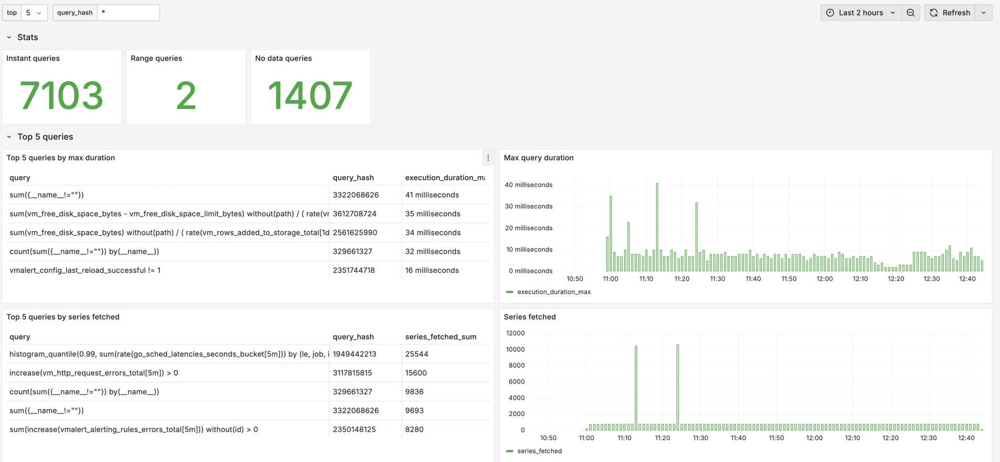

[VictoriaMetrics Enterprise](https://docs.victoriametrics.com/enterprise/) supports logging statistics {} for
read queries made through the [/api/v1/query](https://docs.victoriametrics.com/keyconcepts/#instant-query)
and [/api/v1/query_range](https://docs.victoriametrics.com/keyconcepts/#range-query) APIs.

To enable query statistics logging, add the `-search.logSlowQueryStats=<duration>` command line flag to [vmselect](https://docs.victoriametrics.com/cluster-victoriametrics/)
or [Single-node VictoriaMetrics](https://docs.victoriametrics.com/).
Here's how `<duration>` works:
* `-search.logSlowQueryStats=5s` logs statistics for queries that take longer than `5s`;
* `-search.logSlowQueryStats=1us` logs statistics for **all queries**;
* `-search.logSlowQueryStats=0` turns off query stats logging (this is the default).

**Example of a query statistics log:**
```bash
2025-03-25T11:23:29.520Z        info    VictoriaMetrics/app/vmselect/promql/query_stats.go:60       vm_slow_query_stats type=instant query="vm_promscrape_config_last_reload_successful != 1\nor\nvmagent_relabel_config_last_reload_successful != 1\n" query_hash=1585303298 start_ms=1742901750000 end_ms=1742901750000 step_ms=300000 range_ms=0 tenant="0" execution_duration_ms=0 series_fetched=2 samples_fetched=163 bytes=975 memory_estimated_bytes=2032
```

## Log fields

Each log entry contains the following fields:
* `type`: the type of the query: either [instant](https://docs.victoriametrics.com/keyconcepts/#instant-query)
  or [range](https://docs.victoriametrics.com/keyconcepts/#range-query);
* `query`: the executed [MetricsQL](https://docs.victoriametrics.com/victoriametrics/metricsql/) query;
* `query_hash`: a hash of the `query`. This makes it easier to filter logs for a specific query;
* `start_ms`, `end_ms`, `step_ms` are query params described [here](https://docs.victoriametrics.com/keyconcepts/#range-query);
* `range_ms`: a time range in milliseconds between `start_ms` and `end_ms`. If `range_ms==0` it means this query is instant;
* `tenant`: a tenant ID. Available only in the cluster version;
* `execution_duration_ms`: time it took in milliseconds to execute the query (not including time spent sending results over the network);
* `series_fetched`: number of unique [time series](https://docs.victoriametrics.com/keyconcepts/#time-series) fetched. 
  This may be higher than the number of series returned if there are filters like `cpu_usage > 0`;
* `samples_fetched`: number of [data samples](https://docs.victoriametrics.com/keyconcepts/#raw-samples) fetched;
* `bytes`: number of bytes transferred from storage to process the query;
* `memory_estimated_bytes`: estimated memory needed to run the query. See `-search.maxMemoryPerQuery` cmd-line flag.

## Analysis

It is recommended to collect query statistics logs into [VictoriaLogs](https://docs.victoriametrics.com/victorialogs/)
for performance analysis. Other logging databases can also be used.

Every log entry starts with `vm_slow_query_stats` to simplify the filtering. The fields are formatted in [logfmt](https://brandur.org/logfmt)
to simplify the parsing.

Once logs are in VictoriaLogs, run the following query to find the top 5 slowest queries:
```logsql
vm_slow_query_stats | extract 'vm_slow_query_stats <query_stats>' | unpack_logfmt from query_stats 
| stats by(query) max(execution_duration_ms) execution_duration_max 
| sort by(execution_duration_max) desc | limit 5
```

Here how query works:
* start with `vm_slow_query_stats` to filter only statistics logs; 
* use `extract` and `unpack_logfmt` to parse the log message into fields;
* then calculate statistics, like the maximum execution time.

Other useful [stats](https://docs.victoriametrics.com/victorialogs/logsql/#stats-pipe-functions) you can calculate:
```logsql
| stats by(query) max(execution_duration_ms) execution_duration_max 
```
or 
```logsql
| stats by(query,query_hash) sum(series_fetched) series_fetched_sum
``` 

With [VictoriaLogs Grafana datasource](https://docs.victoriametrics.com/victorialogs/victorialogs-datasource/)
you can build a dashboard to view and filter query stats easily:



The example of Grafana datasource for VictoriaMetrics cluster
is available [here](https://github.com/VictoriaMetrics/VictoriaMetrics/blob/master/dashboards/query-stats.json).
